# Ouvrir docker-desktop

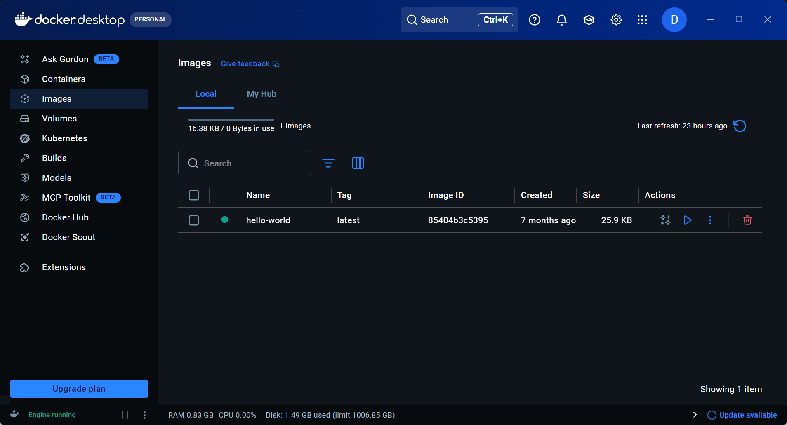

# Placez vous sur le menu à gauche dans “images”

# Trouver le terminal dans Docker Desktop

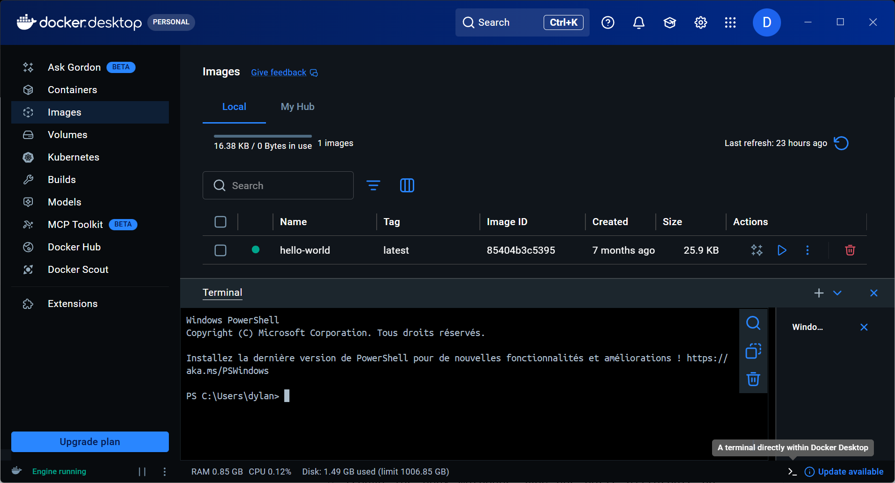

# Chercher l’image docker cité ci-dessus par une commande dans ce dernier

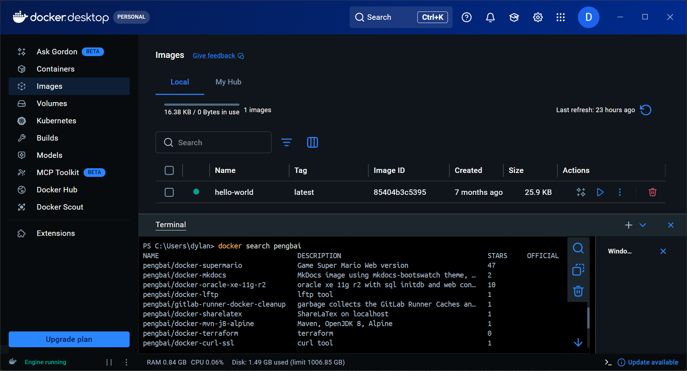

# Récupérer l’image Docker dans “Docker-Desktop” et Observer quand vous avez validé votre commande ce qui c’est passé dans votre fenêtre au dessus

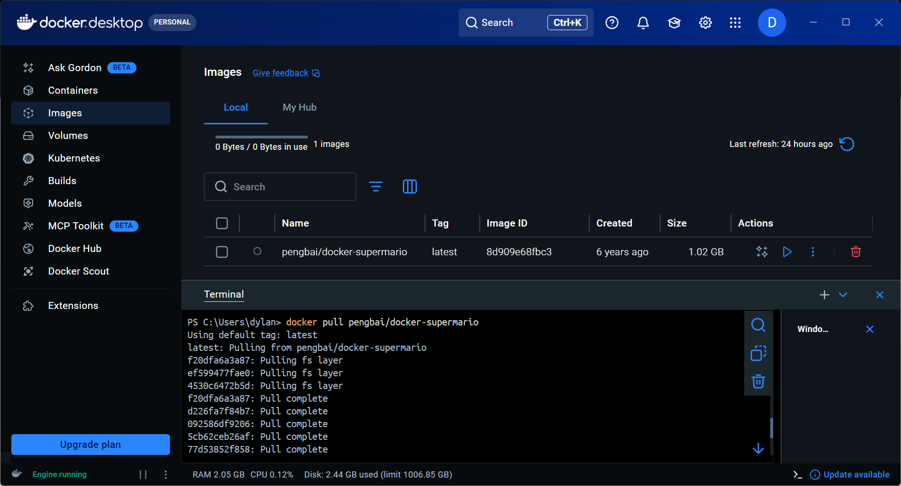

# PLacez vous sur le menu gauche sur container ET Lancer un container avec cette image et assignez lui le port 8600 en considérant que l’image est configuré sur le port 8080 et en conservant l'accès à l’invite de commande (deux methode)

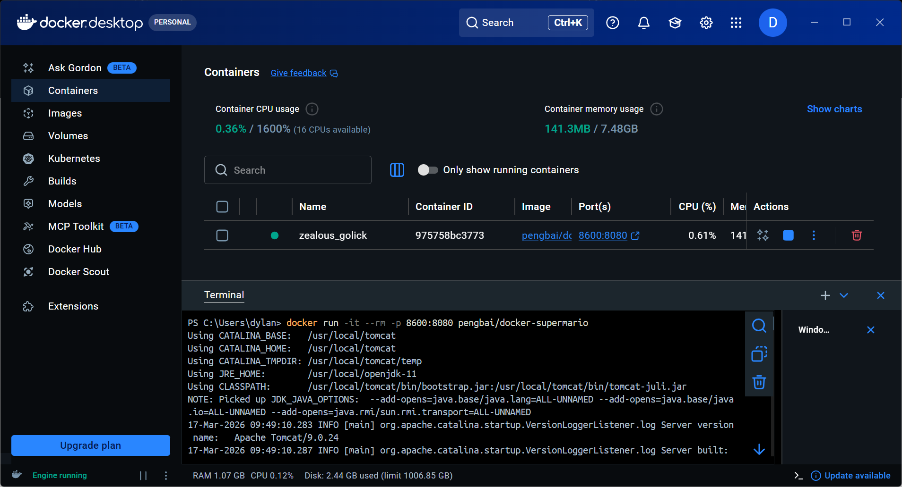
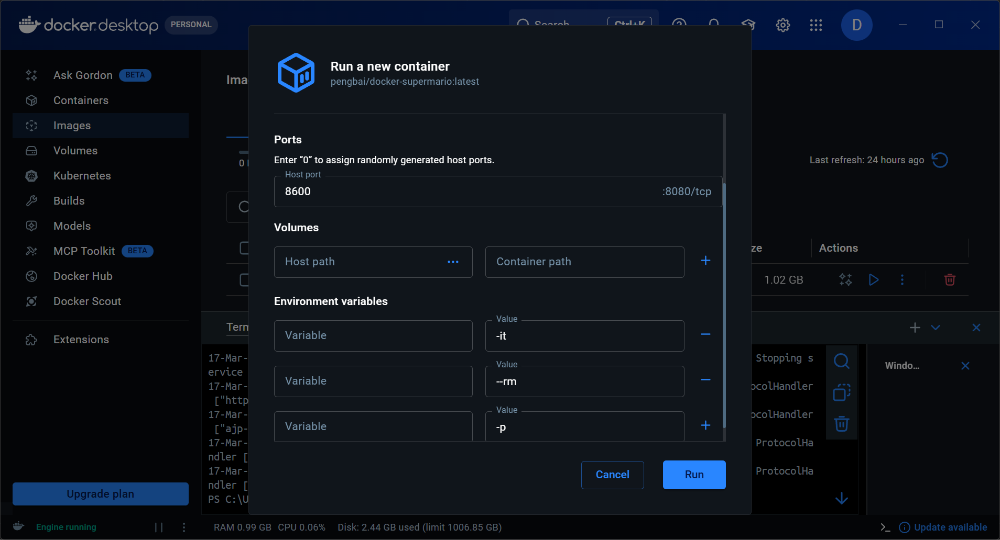

# observer quand vous avez validé votre commande ce qui c’est passé dans votre fenêtre au dessus ET Lancer une autre image de super mario sur un port différent

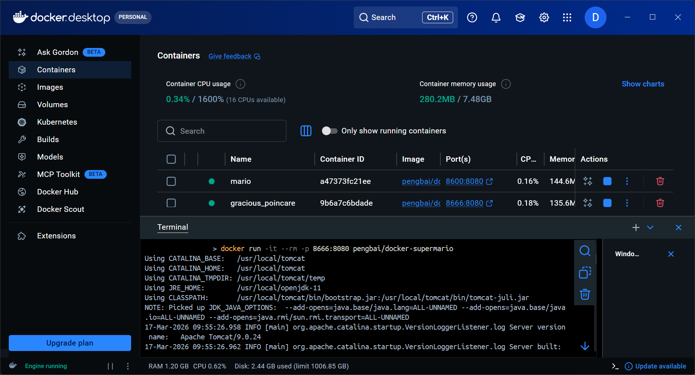

# Ouvrir votre explorateur et trouver le moyen d’accéder au container construit

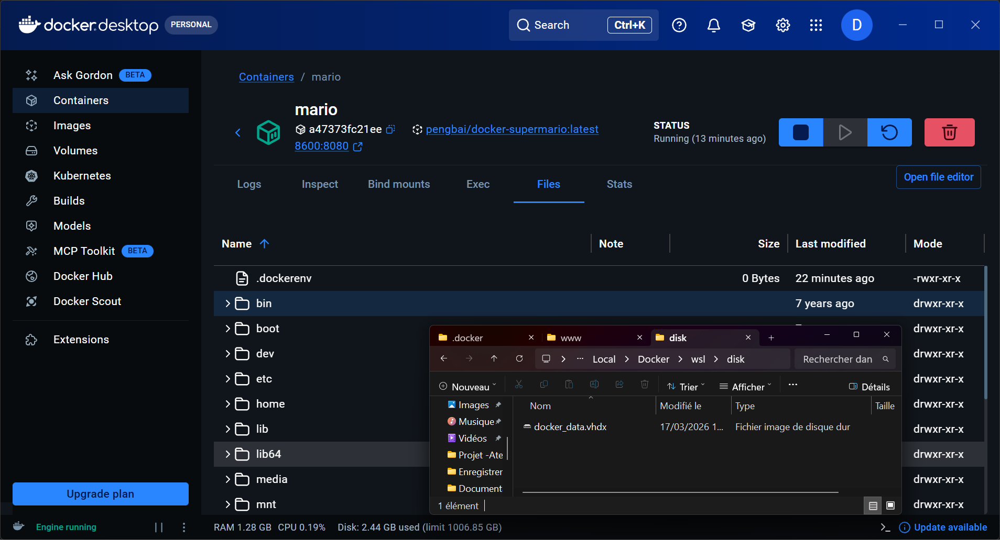

# Accéder et jouer un peu dans votre explorateur internet (faites des captures du jeux en cours “3 au moins”)

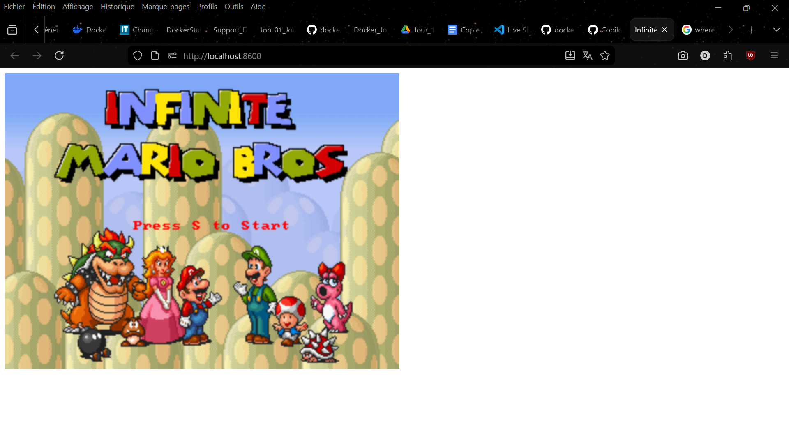
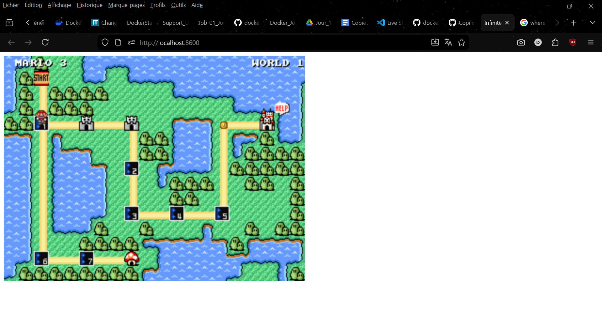
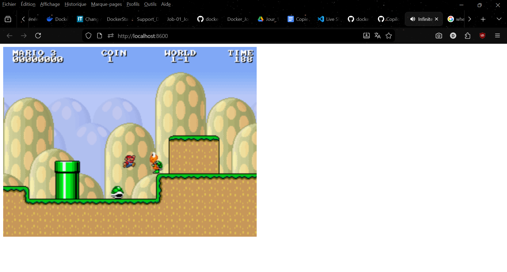

# retourner dans le terminal de docker desktop ET Arrêter votre container par son ID (2 manière de trouver l’ID)

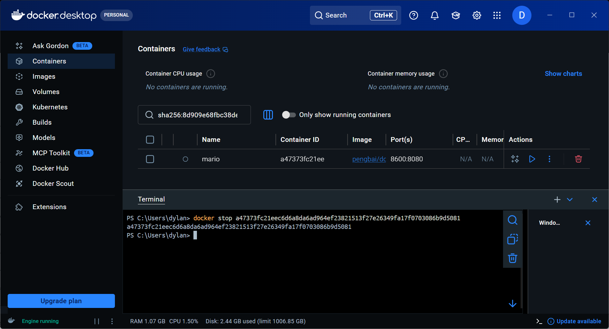
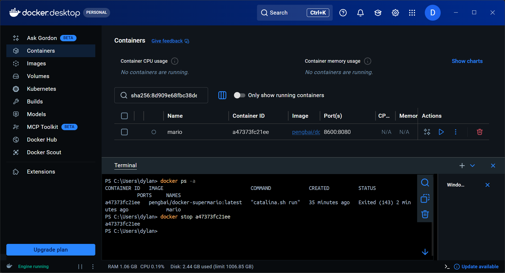

# Supprimer le container (2 manières)

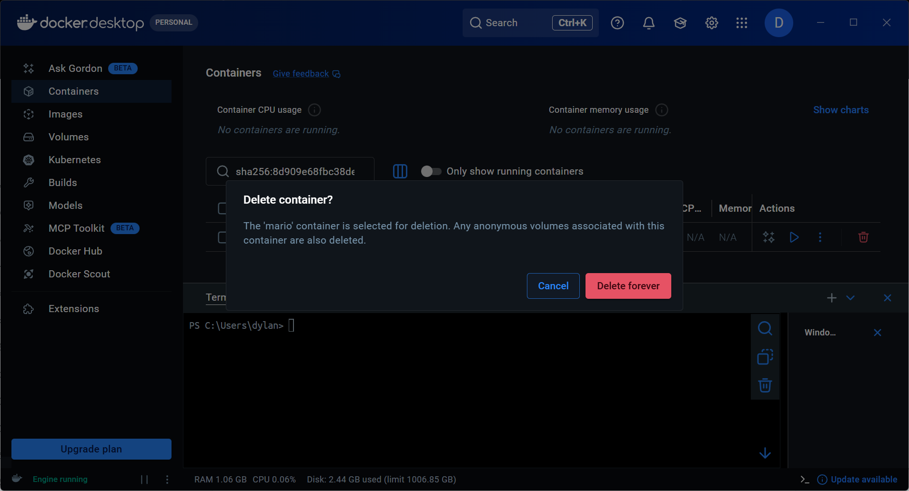
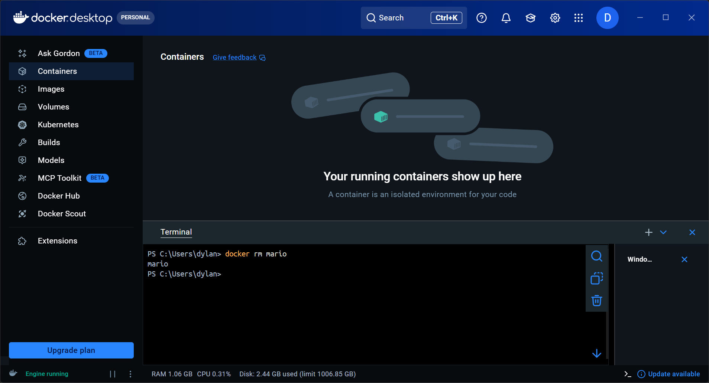

# supprimer l’image docker de super mario (2 manières)

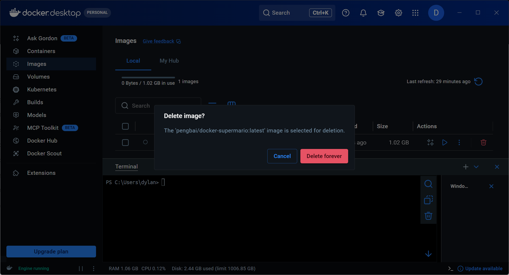
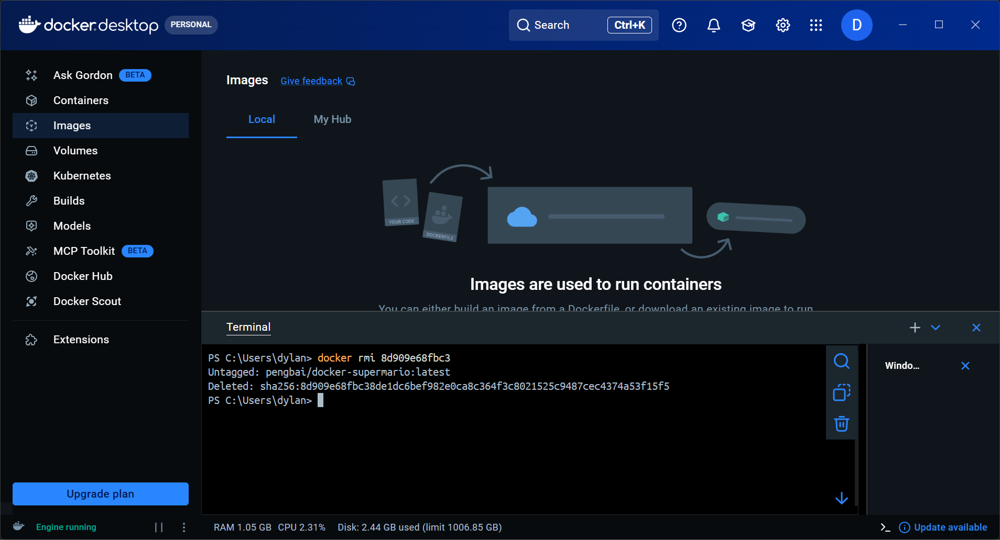
