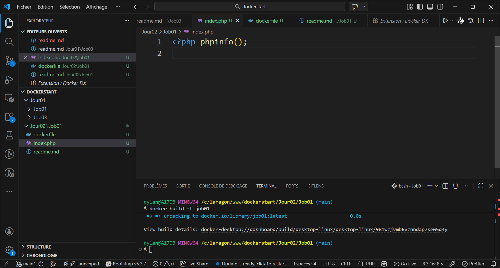
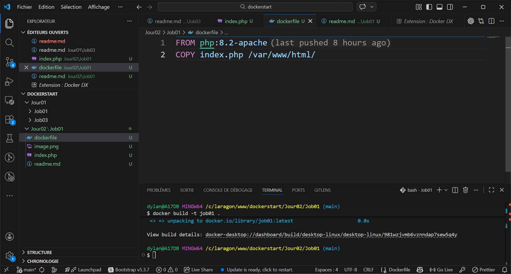
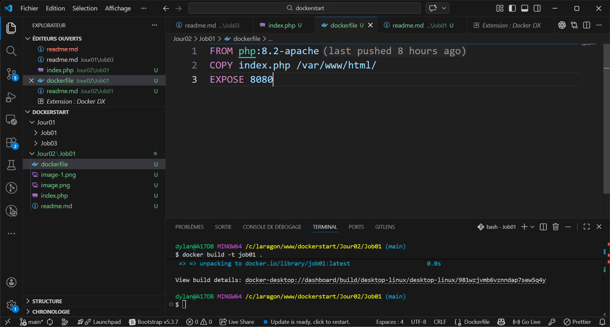
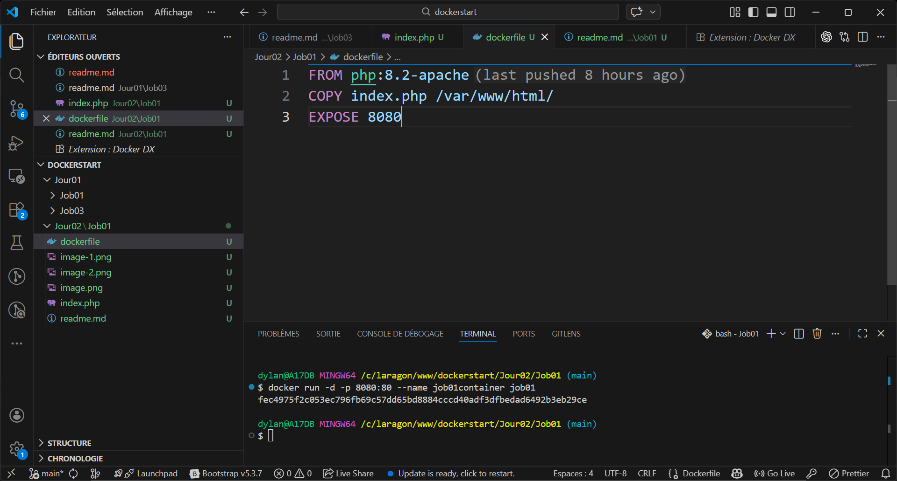
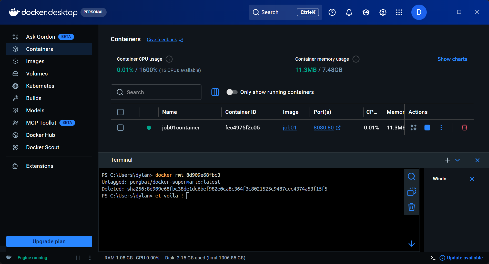
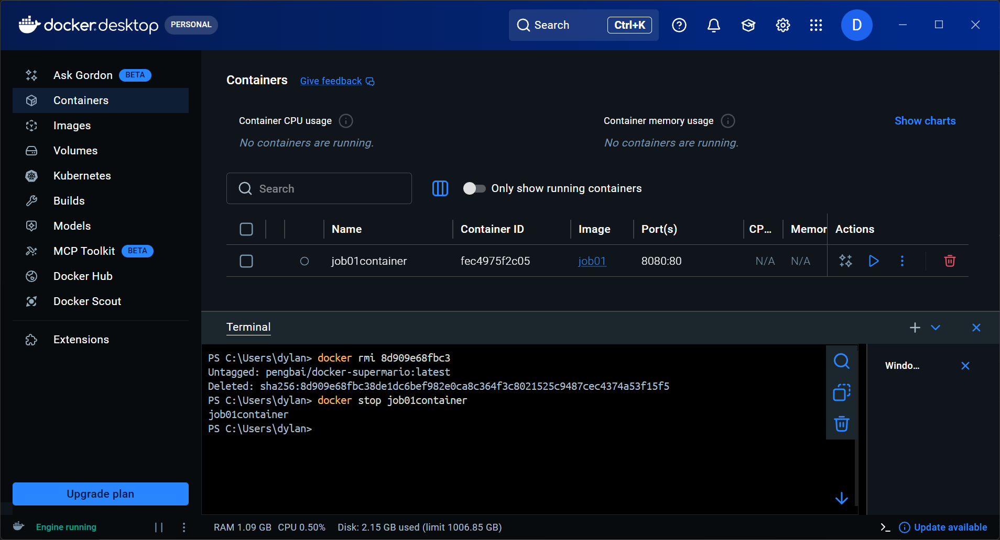

# créer un fichier index.php affichant les info sur le serveur apache (trouver la commande php pour cela, il n'y aura que la balise php et une commande qui en fait que 10 caractères dans le fichier)

# créer un dockerfile qui générera un environnement apache pour afficher cette page

# créer un dockerfile qui générera un environnement apache pour afficher cette page, Application sur le port 80, exposer sur le port 8080 puis créer l’image

# créer le container, faite le tourner

# stopper le
